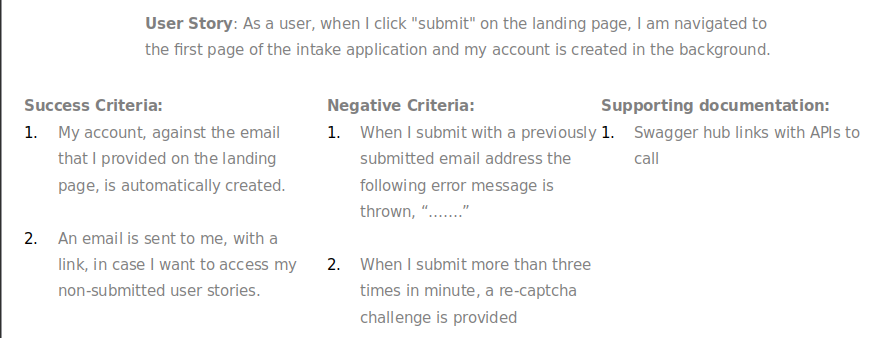
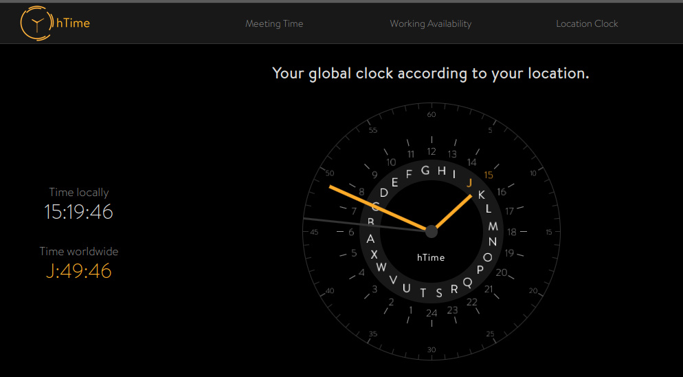
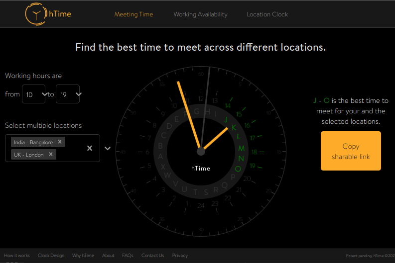

# Managing Remote Teams without Micromanagement

> ...  
> Introduction  
> ....  
> ....

The entire talk is available [here.](https://youtu.be/FATtwOnpwBI)

## What is Archimydes?

It is essentially a software engineering guild at its core. The three central tenets of Archimydes:

- ### Decoupling income from geography
  - Why should you be paid less than your counterpart, in, say, California, for the same kind of work.
- ### Nurturing the excellence of the craft that is Software Engineering
- ### Fostering a sense of community, belonging, and permanence in the ever-changing world.
  - Over your career, you would have dozens of jobs, but the guild would be sort of there for you always, something to count on, the point of permanence in all this change.

To know more about Archimydes, what we are, what we do, and how we do it, you can visit the [website](https://archimydes.dev/).

Now let's get started with the main focus, _**Working and managing remote teams.**_

If we talk about remote working, I think there are three golden rules that need to be kept in mind to make sure remote work happens as smoothly and pleasantly as possible:

1. ### Minimize communication friction
2. ### Optimize timezone compatibility
3. ### Manage results, not time
   
 

### 1. Minimizing communication friction

Communication in any work setting is essential and becomes even more critical when working remotely. Some crucial things conducive to smooth communication are:

1.  **Focus clear written communication**

    From the developers' perspective, user stories are vital, and they tell a story that the developer has to design and code into a reality.

    Let's look at an example.

    **User Story:**

        As a user, when I click "submit" on the landing page, I am navigated to the first page of the intake application, and my account is created in the background.

    Now, this is a decently written user story, but it still leaves certain things unclear.

    A better-written user story would not only provide with the story but some acceptance or success criteria as well, as viewed by the user. Something like this:

    **User Story:**

        As a user, when I click "submit" on the landing page, I am navigated to the first page of the intake application, and my account is created in the background.

    **Success criteria**

        - My account, against the email that I provided on the landing page, is automatically created.

        - An email is sent to me, with a link, in case I want to access my non-submitted user stories.

    An example of even better-written communication would list the user story, the success criteria, the failure criteria, and any support documentation.

    

    Now here we talked from a developer's perspective, but this applies beyond just user stories or sprints.

    > Any task you give somebody to do should be accompanied by the explicit context of
    >
    > - what it means to have successfully completed it
    > - what failed case(or negative success) should look like

    > through templates, examples, reference documentation of some kind. **This becomes pivotal when it comes to effective management of remote teams.**

2.  **Minimize meetings**

    Let's be honest, no one really likes meetings, and while working remotely, we all have realized at some point that Zoom burnout is a real thing. Moreover, meetings take a lot of overhead in the form of the coordination time required to set up a meeting in the first place.

    So, the key would be to make communication as asynchronous as possible.

    **But why do we meet?**  
    It's generally for one of the three reasons listed below:

    - To make certain decisions
    - To ideate/brainstorm
    - to socialise

    Besides these, you might meet for some other reasons. Let's look at some examples and what we can do instead to make things a bit easier:

    ### Replace

    - **Standups --> virtual standups**  
       Standups require all the team members to be present simultaneously, which becomes problematic when working remotely in multiple time zones.
      What we do at Archimydes is we have virtual standups.

      1. The cards being worked on are posted on a Slack channel at a certain time of the day that's already agreed upon.
      2. Those who have doubts, or blockers around the cards, can get them addressed during the virtual standup.
         Now, it might take away some of the values that a standup offers, but most of the time, it is possible to get all the answers you are looking for without everyone being present.

    - **One on Ones -->written memos**  
       One-on-ones, a lot of time end up being a general discussion around some topic. While it is essential to have one-on-one and can't be avoided sometimes, even in those contexts, it might help to **have some form of written communication before the one-on-one**. So that when you do get on the call, you are making some decisions, discussing some actionable plans rather than generally having a discussion.
      > It takes a lot less time to start from some written memo instead of a blank piece of paper.

    But when the meeting is unavoidable, and you do end up meeting:

    - Set an agenda
    - Keep a close watch on the clock
    - Continue to take calls from your desk instead of going to the conference room, if possible.

           This makes calls somewhat inclusive for the people who are in the meeting virtually. It becomes even more critical as companies start moving to a hybrid mode of operation.

3.  **Record and annotate meetings**

    There are now available tools that help in recording and annotating meetings, break it chapterwise in the timestamp. This makes the entire transcript available and the whole meeting searchable.
    There is no need to go through an entire meeting to figure out if it is helpful; you can search it.

    One such excellent tool is [tl;dv.](https://tldv.io/) It lets you tag important moments in the meeting.  
    This allows people to view the recording on their own time and catch up quickly.

    This again falls right into the whole _" making communications asynchronous"_ ideology that we discussed earlier.

 

### 2. Optimizing timezones

1. **Try to keep teams in max +/-6 hours timezones**
2. **Virtual standups when possible**

The reason for this is, although you can use asynchronous communication, like slack or emails sometimes, you can't do it without a meeting, one on one, or a standup, perhaps.  
In this case, it becomes challenging to manage availability and find the right time for such communications. Moreover, if the time zones are farther apart, it might become virtually impossible to find a good time to meet.

One tool that can be used in this case to find a good time for meets, to make your availability known publicly, is [hTime](https://thehtime.com/).

It tries to establish a global timezone using a set of letters to denote time.

An example of how you might use it:

Let's say we have one team working out of Bengaluru and the other one in London; how do we find the best time to meet?

    1.  Go to the "Meeting time" tab.
    2. Select your working hours
    3. Select the timezones
    4. The clock shows in green the good times to meet.
    5. Share the same using a sharable link.

Check out the [website](https://thehtime.com/) to discover other use-cases.

3. **Team alignment**  
   Try to segregate the team such that the customer-facing units( product managers, business analysts, designers) who might require constant communication with the customer are preferable in the same timezone as the customer itself. The engineering, QA, solution architects, or other such units might be in a slightly wider timezone.

- **Some other major considerations**

  - **Team Morale**: Giveaways, Birthdays, Offsites, etc.

  - **Hiring**: Auditions, not interviews; also – do you need to hire vs. out-task? Is there enough work for an FTE?

  - **Remote Work != Work From Home**: Not everyone is comfortable working from home

 

### 3. Managing results, not time!

Often, people traditionally have gone to the office purely for "**face-time**," the assumption being, "I'm there, and hence it means I'm working." This is not a great assumption and not a great way of managing people based on their "time".  
While it is not a very good way to manage and perceive progress, to begin with, it was still somewhat used in the traditional setting. This would not only "not" work in a remote setting but be an absolute failure for the company management and very bad for the employee morale overall in the long run.

> There is a _need for change_, as companies move to remote first and hybrid settings, _in how progress is measured and managed, moving from a time oriented to a result or task oriented paradiagm_.

This completes the coverage of "the Golden rules" for remote working that I mentioned earlier.

 

Now concluding on a happier note, this phase is a stress test for remote work. If you have done well in this environment in the last year, you'll be just fine moving forward and find remote work setting to be much more pleasant, as remote becomes the new normal and companies start developing better support frameworks for remote work.

To view the recorded presentation, click [here](https://youtu.be/FATtwOnpwBI).
